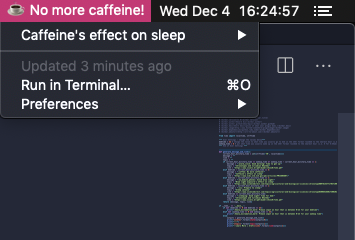

# Digital Zeitgebers

A [BitBar](https://github.com/matryer/bitbar) plugin that reminds you with sleep hygiene recommendations, such as when to avoid blue light, caffeine, etc., at the proper time.

## Installation
1. Download the latest version of BitBar [here](https://github.com/matryer/bitbar/releases/download/v1.9.2/BitBar-v1.9.2.zip)
2. Move the BitBar application to your Applications folder
3. Open BitBar and BitBar will prompt you to set a plugins folder - you may set it to any folder you like
4. Click on `BitBar` in your MacOS menu bar and click `Open Plugin Folder...`
5. Download `digital-zeitgebers.30m.py` into the plugin folder opened in the previous step
6. Open `digital-zeitgebers.30m.py` in a text editor and update the `bedtime` and `wakeup_time` values under the `User Settings` section
7. Right click anywhere in the plugin folder and select [`Open Terminal Here`](https://lifehacker.com/launch-an-os-x-terminal-window-from-a-specific-folder-1466745514)
8. Run the following command in Terminal: `chmod +x digital-zeitgebers.30m.py`
9. Click on `BitBar` in your MacOS menu bar and click `Refresh all`

___Note: If nothing shows up on your menubar after clicking `Refresh all`, it just means that there are no sleep hyigene recommendations at this time. Any errors will be shown to you on the menubar___

## Supported OS

Currently Digital Zeitgebers is only works for MacOS, because it is a plugin for BitBar which is only available on MacOS.

## References
- [Influence of chronotype and social zeitgebers on sleep/wake patterns](http://www.scielo.br/pdf/bjmbr/v41n10/7132.pdf)
- [Night owls can 'retrain' their body clocks to improve mental well-being and performance](https://www.sciencedaily.com/releases/2019/06/190610100622.htm)
- [Caffeine Effects on Sleep Taken 0, 3, or 6 Hours before Going to Bed](https://www.ncbi.nlm.nih.gov/pmc/articles/PMC3805807/)
- [Chapter 30 - Jet Lag and Its Prevention](https://www.sciencedirect.com/science/article/pii/B9781437717037100301)
- [Chapter Three - Natural Variation in Human Clocks](https://www.sciencedirect.com/science/article/abs/pii/S0065266017300202)

